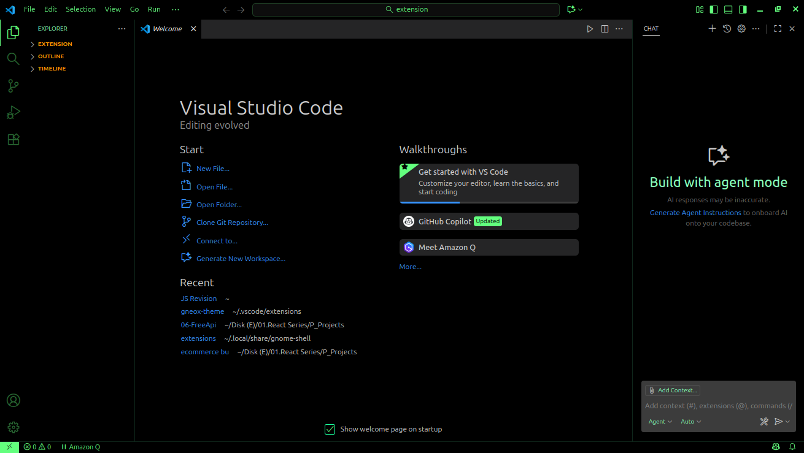

# Gneox Theme

A sleek, simple and modern Visual Studio Code theme that combines neon-green UI elements with a carefully crafted two-tone syntax highlighting scheme, designed for enhanced readability and reduced eye strain during long coding sessions.

## Features

- 🎨 Neon-green UI accents that provide a distinctive and modern look
- 📖 Two-tone warm syntax highlighting for improved code readability
- 💫 Stylish italic formatting for keywords and comments
- 🎯 Carefully balanced contrast ratios for comfortable viewing
- 🌈 Full two-tone string coloring for better code distinction

## Screenshot

## Feedback

If you have suggestions or find any issues, please feel free to:
- [Open an issue](https://github.com/neoxsa/gneox-theme/issues)
- [Submit a pull request](https://github.com/neoxsa/gneox-theme/pulls)

## License

This theme is released under the MIT License. See the [LICENSE](LICENSE) file for details.
